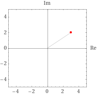

# Let's Make a Complex Number

## Introduction

I've been playing with the Mandelbrot Set lately, which has meant that I've had to dust off my memory of how to do arithmetic with them. In doing this I created a nice JavaScript class help grease using them.

## A Quick Refresher

When we multiply two numbers together the result will be odd or even depending on whether the numbers we're multiplying are:

```
-1 *  1 = -1
 1 * -1 = -1
 1 *  1 =  1
-1 * -1 =  1
```

Now, `1 * 1 ≔ 1²` and `-1 * -1 ≔ (-1)²` and both these equal `1`. There is no number that one can square that produces a negative number, which is where the _imaginary number_ comes into play. The letter `i` is used to represent the number which, when squared, equals `-1`.

```
i² ≔ -1
```

It's literally another number line, just like we have `-2, -1, 0, 1, 2, 3, 4, …` we have `-2i, -1i, 0i, 1i, 2i, 3i, 4i, …`.

A complex number is a number that have a _real_ part and an _imaginary_ part. They're written in the form `a + bi`.

As `0i ≔ 0` the number lines meet at `0`, so we can plot these numbers on a graph, typically the x axis is the real number line and the y axis is the imaginary one.

### Some examples

-   
    `3 + 2i` in the complex plane


`-15 + 9i` in the complex plane


`3 - 8i` in the complex plane

### Arithmetic

You might be thinking that these look allot like vectors. With the caveat that `i² ≔ -1` everything is really vector arithmetic.

## Code

The `Complex` class constructor has two parameters, `real` and `imaginary`.

```javascript
export class Complex {
    constructor(real, imaginary) {
        this.real = real;
        this.imaginary = imaginary;
    }
}
```

### Zero

```javascript
/***
 * Generate a new <code>Complex(0,0)</code>
 * @returns {Complex}
 */
static zero = () => new Complex(0, 0);
```

### toString()

```javascript
/***
 * Returns a string in the form <code>a ± bi</code>.
 * @returns {string}
 */
toString() {
    const operator = this.imaginary < 0 ? '-' : '+';
    return `${this.real} ${operator} ${Math.abs(this.imaginary)}i`;
}
```

### Equals

```javascript
/***
 * Both <i>real</i> and <i>imaginary</i> parts are equal.
 * @param other
 * @returns {boolean}
 */
equals(other) {
    return this.real === other.real && this.imaginary === other.imaginary;
}
```

### Add

```javascript
add(other) {
    return new Complex(
        this.real + other.real,
        this.imaginary + other.imaginary
    );
}
```

### Subtract

```javascript
subtract(other) {
    return new Complex(
        this.real - other.real,
        this.imaginary - other.imaginary
    );
}
```

### Multiply

Elementary multiplication expansion.

```none
(a + bi)(c + di) = a(c + di) + bi(c + di)
                 = ac + adi +cbi + bdi²
                 (i² ≔ -1)
                 = ac + adi + cbi -bd
                 (rearranging)
                 = (ac - bd) + (adi + cbi)
                 = (ac - bd) + (ad +cb)i
```

```javascript
/***
 * Multiple this Complex with another.<br/>
 * <code>(a + bi)(c + di) = (ac - bd) + (ad + bc)i</code>
 * @param other
 * @returns {Complex}
 */
multiply(other) {
    return new Complex(
        this.real * other.real - this.imaginary * other.imaginary,
        this.real * other.imaginary + this.imaginary * other.real
    );
}
```

### Divide

More complicated that multiplication.

**NB:** The complex conjugate `a + bi` is `a - bi`.

```javascript
/***
 * <code>(a + bi) / (c + di) = [(ac + bd) / (c^2 + d^2)] + [(bc - ad) / (c^2 + d^2)]i<code>
 * @param other
 */
divide(other) {
    const otherMagnitudeSquared =
        other.real * other.real + other.imaginary * other.imaginary;
    const r =
        (this.real * other.real + this.imaginary * other.imaginary) /
        otherMagnitudeSquared;
    const i =
        (this.imaginary * other.real - this.real * other.imaginary) /
        otherMagnitudeSquared;

    return new Complex(r, i);
}
```
